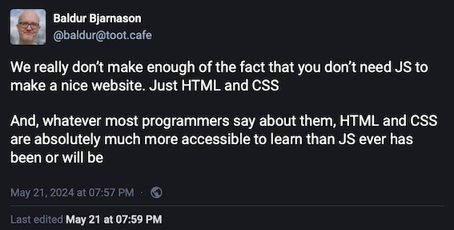

I am a Tolkien Fan, if you didn't guess it yet. And as such I wanted to make for quite a while a comprehensive website about ... well, everything in Tolkiens world.
A few days ago I came across a statement on Mastodon by Baldur Bjarnason (@baldur@toot.cafe). He said the following:



And I thought: can you actually build what I have in mind solely with html and css? Without going crazy? Pedigrees, indexes, cross-referencing everything?
No frameworks, no JavaScript, no database, no nothing?
Let's see ...

The contents of this site will be pure canon. No fandom, no movies and most certainly not the series. The written word of J. R. R. Tolkien, nothing else.


## BUILD
```
docker build -t tolkien .
```

## RUN after build
```
docker run -it --rm -d -p 8080:80 --name tolkien tolkien
```

## RUN with new code, without new build
```
docker run -it -p 8080:80 -v <path to>/code:/usr/share/nginx/html tolkien
```